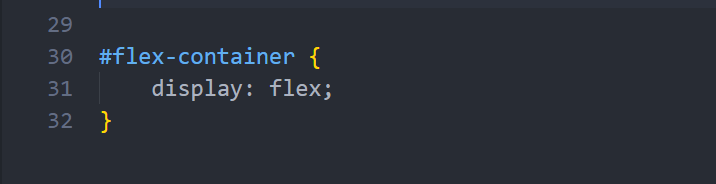

# What you will learn?

- Understanding what flexbox is and how it works.
- Learning the usage of the most commonly used flexbox-related CSS properties like:
    - flex-direction
    - justify-content
    - align-items
    - flex-wrap
    - gap
- Learning how to properly create a realistic layout for your project with an example


# What is Flexbox?


The **flexbox layout**, officially known as the **Flexible Box Layout module**,
 is a CSS layout model that provides a more efficient way to arrange and 
 align elements within a container. 
 
It offers a one-dimensional layout model, meaning it operates along either the `row` or `column` direction.

Generally speaking, it’s a good idea to use Flexbox layout because of its ease of use,
 it handles most of your item arrangement-related challenges with its dedicated CSS properties
 and it has great browser support as most modern browsers support it. 

The way it works is that you first have to create a container that serves as your flexbox container. 

With the 

```css
.flex-container {
    display: flex;
}

```

CSS property is set to your container will become a **flexbox container**, 
which means that you also unlocked the flexbox-related **CSS properties** to define how the items inside of your flexbox container should appear.

Any `<div>`, `<main>`, `<nav>`, `<section>`, `<footer>` etc. can be a valid container.

See further examples in the guided project.

# flex-direction

The next step is to decide the direction you want to align the items inside of your flexbox with the flex-direction property.

```css
.flex-container {
    display: flex;
    flex-direction: column;
} 
```

flex-direction can have up to four values:
    - `row`
    - `row-reverse`
    - `column`
    - `column-reverse`

The fallback value of `flex-direction` is `row` in case you don't specify it otherwise.

With the `flex-direction`, you are also declaring if the **main axis** should be **vertical** or **horizontal** and the **cross axis** as the opposite of the **main axis**.

If you set the `flex-direction` to `row` or `row-reverse` then the **main axis** will be **horizontal** and the **cross axis** will be **vertical**,
and if you set it to `column` or `column-reverse` then it will be the other way around.

The demonstration below will have the `flex-direction` set to `row`, notice that the **main axis** is now **horizontal** and the **cross axis** is **vertical**.



# justify-content
With all of this being kept in mind, we can set how the items in the flexbox should be aligned relative to the main axis with the justify-content property.


```css
.flex-container {
    display: flex;
    flex-direction: row;
    justify-content: center;
} 
```

The `justify-content` property can have several values, all with different browser support, but the `center`, `flex-start` and `flex-end` values are generally supported by most browsers.

The `space-between`, `space-around` and `space-evenly` values are also widely supported and generally speaking, you won't have any issue using these values and neither will your target audience, because these values enjoy decent browser support too.

The meaning of these values is pretty self-explanatory. But let's take a closer look at these values regardless.

- `justify-content`: `center` The items will be positioned to the **center** compared to the **main-axis**, if the `flex-direction` is set to `row` this means that your items will be **horizontally centered**.


- `justify-content`: `flex-start` The items will be positioned to the **start** of the **main-axis**, if the `flex-direction` is set to `row` this means that your items will be positioned to the **left side** of the Flexbox.


- `justify-content`: `flex-end` is the opposite of `flex-start` meaning that your items will be positioned at the end of the **main-axis**, which if you set the `flex-direction` to `row`
will result in having your items at the **right side** of the Flexbox.


- `justify-content`: `space-between` Your items will be evenly distributed along the **main-axis**. The first item is going to be at the start of the **main-axis**, and the last item is going to be at the end of the **main-axis**.


- `justify-content`: `space-around` Your items are evenly distributed along the **main-axis** with equal space around them.


- `justify-content`: `space-evenly` Your items are distributed so that the spacing between any two items (and the space to the edges) is equal.


# align-items

At this point, you are already familiar with your options about positioning your items compared to the **main-axis**, now let's check how you can position them compared to the **cross-axis**.

You can achieve this with the `align-items` property.

```css
.flex-container {
    display: flex;
    flex-direction: row;
    justify-content: space-evenly;
    align-items: center;
} 
```

Like `justify-content`, `align-items` can have similar values. In fact, it has the same 
- `flex-start`
- `flex-end`
- `center`
- `space-between`
- `space-around`
- `space-evenly`

values as `justify-content` with the same behavior apart from aligning the items compared to the **cross-axis** instead of the **main-axis**.

In the next demonstration, the `justify-content` property will keep its `space-evenly` value and only the `align-items` property will be changed.

- `align-items`: `center` 


- `align-items`: `flex-start` 


- `align-items`: `flex-end` 


- etc.

# flex-wrap

By default, **flex items** will all try to fit onto **one line** even if it means that their size may have to shrink. You can change that and allow the items to break into multiple lines if needed with the `flex-wrap` property.

```css
.flex-container {
    display: flex;
    flex-direction: row;
    justify-content: space-evenly;
    align-items: center;
    flex-wrap: wrap;
} 
```

`flex-wrap` can have up to three values:

- `nowrap` (default): all flex items will be on one line
- `wrap`: flex items will wrap onto multiple lines, from top to bottom.
- `wrap-reverse`: flex items will wrap onto multiple lines from bottom to top.

For the sake of demonstration, the with of the previously flexbox container has been reduced. Let's see how the `flex-wrap` property will make the items appear.

- `flex-wrap`: `nowrap` Noticed how the `width` of the items has been shrunk so that each item can fit into one row?


- `flex-wrap`: `wrap` Here the first four items can fit into one row without having to reduce their `width` but the fifth item has been put into a new row.


- `flex-wrap`: ``wrap-reverse` The same as last time, but the order has been reversed.


# gap


