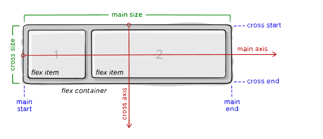

# What you will learn?

- Understanding what flexbox is and how it works.
- Learning the usage of the most commonly used flexbox-related CSS properties
- Learning how to properly create a realistic layout for your own project 


# What is Flexbox?


The **flexbox layout**, officially known as the **Flexible Box Layout module**,
 is a CSS layout model that provides a more efficient way to arrange and 
 align elements within a container. 
 
It offers a one-dimensional layout model, meaning it operates along either the `row` or `column` direction.

Generally speaking, it’s a good idea to use Flexbox layout because of its ease of use,
 it handles most of your item arrangement-related challenges with its dedicated CSS properties
 and it has great browser support as most modern browsers support it. 

The way it works is that you first have to create a container that serves as your flexbox container. 

With the 

```css
.flex-container {
    display: flex;
}

```

CSS property is set to your container will become a **flexbox container**, 
which means that you also unlocked the flexbox-related **CSS properties** to define how the items inside of your flexbox container should appear.

Any `<div>`, `<main>`, `<nav>`, `<section>`, `<footer>` etc. can be a valid container.

See further examples in the guided project.

The next step is to decide the direction you want to align the items inside of your flexbox with the flex-direction property.

```css
.flex-container {
    display: flex;
    flex-direction: column;
} 
```

flex-direction can have up to four values:
    - `row`
    - `row-reverse`
    - `column`
    - `column-reverse`

The fallback value of `flex-direction` is `row` in case you don't specify it otherwise.

With the `flex-direction`, you are also declaring if the **main axis** should be **vertical** or **horizontal** and the **cross axis** as the opposite of the **main axis**.

If you set the `flex-direction` to `row` or `row-reverse` then the **main axis** will be **horizontal** and the **cross axis** will be **vertical**,
and if you set it to `column` or `column-reverse` then it will be the other way around.

The demonstration below will have the `flex-direction` set to `row`, notice that the **main axis** is now **horizontal** and the **cross axis** is **vertical**.




With all of this being kept in mind, we can set how the items in the flexbox should be aligned relative to the main axis with the justify-content property.


