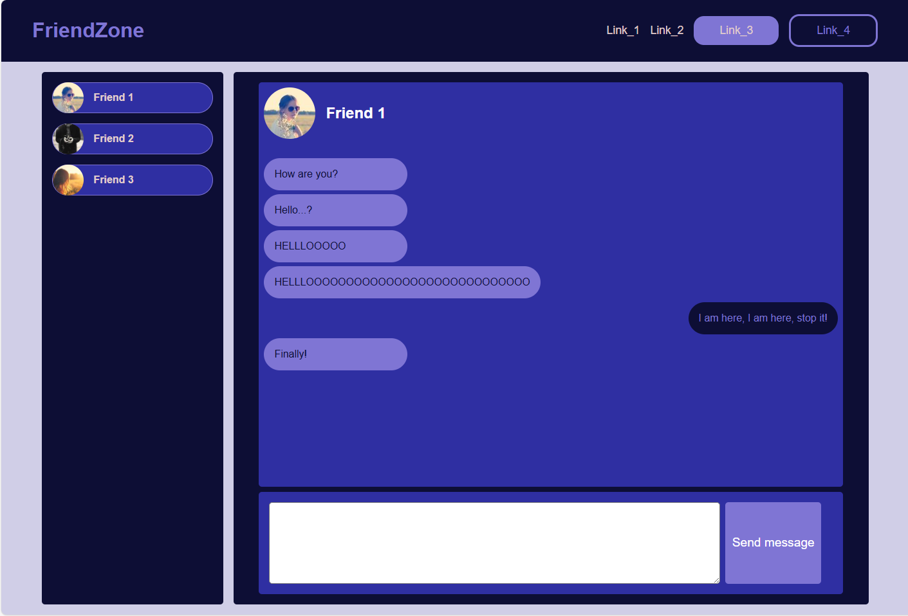
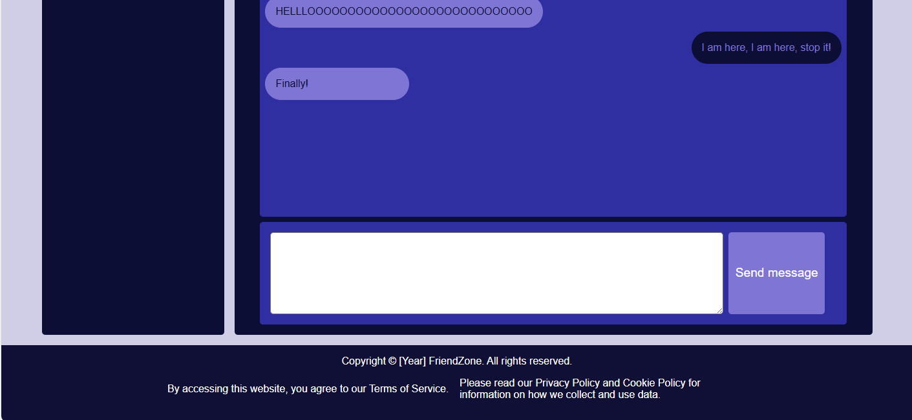

# My Social Media

Social media, depending on your preferences, this can be mankind's best invention ever or a necessary evil.
But regardless of your preferences, I think we can agree that using an application you made is always better than using someone else'.

At this point, you are ready to create the layout of your own social media site.

For this project, it's perfectly ok to just create an HTML and CSS file and view them with your browser directly.

# Tasks

**Setup**

Clone the starter repository and create a new HTML and CSS file for your project, you can call them index.html and style.css. You can also generate a simple HTML template with the help of your VS Code IntelliSense by typing `!` and pressing enter, and don't forget to import your newly created CSS file. 

1. `git cloned` the starter repository and create a new **HTML** and **CSS** file inside of it.
2. Generate an HTML starter template and import your newly created CSS file.

**Every Web App Needs a Navbar**

Create a container that will contain the **title** of your app as well as some **links**. Make the title appear on the left side of your container and the links should appear on the right side inside of the container.

Make the links inside of your navbar have `gap` between each other.

1.  New navbar container have been created.
2.  The title of your app appears on the left side of the navbar.
3.  The links for the navbar appear on the right side inside of the navbar.
4.  You can hardcode a few links inside of the navbar as anchor elements (`a`).
5.  The links have some amount of `gap` between each other.
6.  You can add some basic styling for the navbar eg.: changing the `background color`, setting the `font size`, adding a `hover` effect on the **links** etc. You can go wild here.

**A place for contacts, chat history and a textarea**

Below the navbar let's divide the page into two sections, one for displaying your contacts this can be a smaller section on the left side and another section for displaying your chat history and for a `textarea` below for user input.
You can place a `button` next to the `textarea` too.

*Check the example image at the bottom of the page.*

1. A contact container appears on the left side, this can take around 20% of the screen's width.
2. Another container has been created for the chat history and user input.

**Footer with privacy policy**

In the **EU**, every website must display, how they collect, use, store, and protect personal data in compliance with the **General Data Protection Regulation** **(GDPR)**. It's also common practice to display some links regarding your **Terms of Service** around this area.

On most websites, **links** and information about these policies and such are displayed in the Footer.

Let's create a `Footer` container at the bottom of the screen and display some information like this. Naturally, you don't have to come up with your own policies for this task. It's enough if you display some text there with an **empty link**.

*Check the example image at the bottom of the page.*

1.  Create a footer at the bottom of the screen and add some basic styling to it (eg.: height, width)
2.  Make some text appear at the top of the footer, here you can place some text, this will be a placeholder for copyright-related information.
3.  Below the copyright placeholder try to organize some placeholder text for your **Terms of Service** as well as your **Privacy policy**. Try to make them appear next to each other.

**OPTIONAL TASK: Contacts appear with style**

Could you create some hardcoded contacts in your contacts container?
The goal would be to make these contacts appear in a nice organized manner. 
Most of the time this means that contacts are listed right below each other.
You can even add a placeholder for an image of you wish.

1. A single contact appears in a container, the name and an image are enough information.
2. The individual contacts have some `gap` in-between each other.

**OPTIONAL TASK: Chat history with messages**

You already created a container to display the previous messages you received and sent, let populate this area with some hardcoded messages, make them appear similar to the example image at the bottom of the page or to some social media site or app you are using.

*You can use the `align-self` attribute to make your messages an exception to the CSS rules you defined.*

1. The messages the user receives appear on the left side of the screen in a tasteful manner.
2. The user's own messages appear on the other side of the screen.

**OPTIONAL TASK: Add further styling to the project**

Feel free to add some further styling to this project, if you got stuck, feel free to ask a mentor for help or suggestions, and be sure to show us what you managed to come up with.

# Hints

    You can view an example solution, but it's recommended to try to solve the task on your own first and only look at the example project when it's really necessary.

    To make your own messages align to the opposite side of the screen than the messages you received you can use the `align-self` attribute.

# Example

