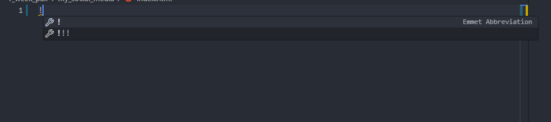
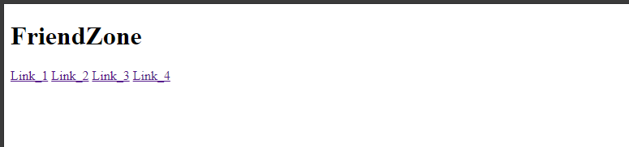
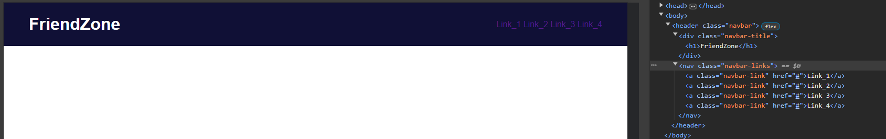
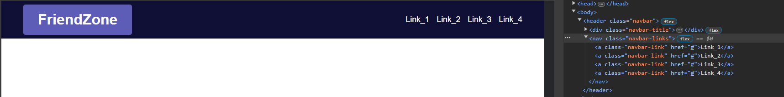

# Guide for My Social Media

Here you will be able to see a potential solution for the task called My Social Media. It's perfectly ok to not follow every step the same way the guide says, you can still experiment with your own ideas if you wish.

The guide will also contain the thought process of a mentor who solved this task for the first time.

# Setup

After cloning the repository with `git clone <repository>`, we can start working.

First things first, let's create the two files we will need for this task.

I will create a file called **index.html** and **style.css** and I will type `!` and press `enter` to generate an HTML template with the built-in VS Code IntelliSense.



After this step, I changed the **title** and imported the newly created `style.css`. Now my `index.html` file looks like this:

```html
<!DOCTYPE html>
<html lang="en">
<head>
    <meta charset="UTF-8">
    <meta name="viewport" content="width=device-width, initial-scale=1.0">
    <link rel="stylesheet" href="style.css">
    <title>FriendZone</title>
</head>
<body>
    
</body>
</html>
```


# Every Web App Needs a Navbar

Here the task requires me to create the `header` container for the project and inside of it, some **links** in a `nav` and the **title** of the web app as an `h1` should appear in a specified way.

I will **start** with **creating** these **elements** and I will **add** an appropriate `class` for each **element**.

Additionally, I decided to make the **title** appear in a slightly more stylish way so I put it in a `div` container which will also receive some styling.

After these changes, the `body` of my `index.html` looks like this:

```html
<body>
    <header class="navbar">
        <div class="navbar-title">
            <h1>FriendZone</h1>
        </div>
        <nav class="navbar-links">
            <a class="navbar-link" href="#">Link_1</a>
            <a class="navbar-link" href="#">Link_2</a>
            <a class="navbar-link" href="#">Link_3</a>
            <a class="navbar-link" href="#">Link_4</a>
        </nav>
    </header>
</body>
```

Now, my `header` looks like this in the browser:



As you can see, this looks pretty ugly because no style has been added to it just yet.

Let's change this.

In my `style.css` I made my `header` which has the `class="navbar"` into a Flexbox with the `display: flex;` **CSS property**, I set the `flex-direction` to `row`, I set the `justify-content: space-between;` so that my elements will be positioned to the **left** and **right** side **horizontally** and I set the `align-items: center;` so that my elements will be **vertically** **centered**.

I set some additional properties as well to make the **navbar** appear more nicely, and I **disabled** some of the **default CSS** for certain elements.

Now, my `style.css` looks like this:

```css
*,
*::after,
*::before {
    margin: 0;
    padding: 0;
    text-decoration: none;
    box-sizing: border-box;
    font-family: Arial, Helvetica, sans-serif;
}

.navbar {
    display: flex;
    flex-direction: row;
    justify-content: space-between;
    align-items: center;

    height: 10dvh;
    width: 100%;
    padding: 0rem 3rem 0rem 3rem;
    background-color: rgb(16, 16, 54);
    color: white;
}
```



Much better isn't it? Well, we are still not done yet. The task gives me some free hand about how to style this **navbar** and it also requires me to **add** a reasonable amount of `gap` **between** those **links**.

The `nav` container has the `class="navbar-links"`, I will turn this `nav` container into a Flexbox as well and I will add some `gap` between the links inside of it with the `nav` container.

After some minor additional styling adjustments, I added these settings to the `header` so far:

```css
.navbar-links {
    display: flex;
    flex-direction: row;
    justify-content: flex-start;
    align-items: center;
    gap: 1rem;

    height: 100%;
    width: auto;
}

.navbar-link {
    color: white;
    font-size: 1.1rem;
}

.navbar-title {
    display: flex;
    flex-direction: row;
    justify-content: center;
    align-items: center;

    width: auto;
    height: 80%;
    background-color: rgb(93, 93, 184);
    border-radius: 5px;
    padding: 0rem 2rem 0rem 2rem;
} 
```


You may choose to have a more sophisticated `header`, but this time, I will stick with this.

# A place for contacts, chat history and a textarea