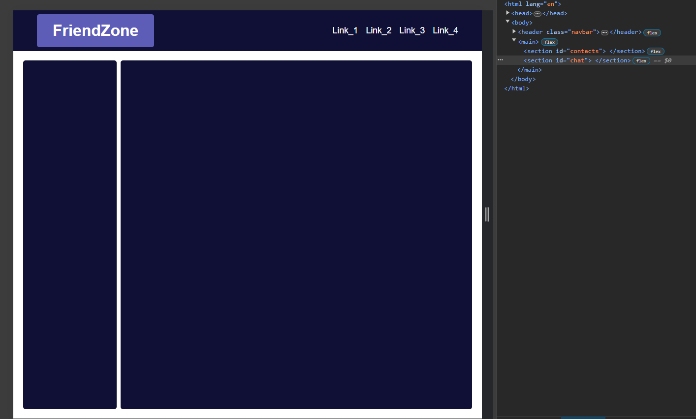
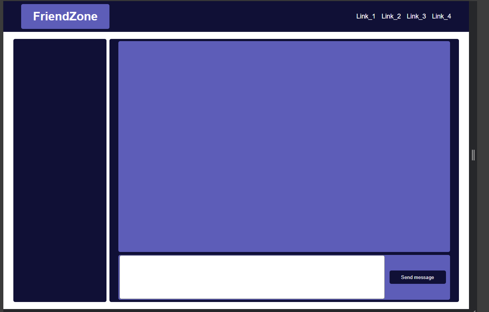
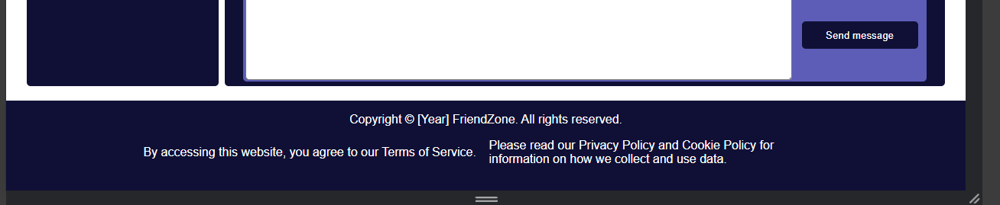

# Guide for My Social Media

Here you will be able to see a potential solution for the task called My Social Media. It's perfectly ok to not follow every step the same way the guide says, you can still experiment with your own ideas if you wish.

The guide will also contain the thought process of a mentor who solved this task for the first time.

# Setup

After cloning the repository with `git clone <repository>`, we can start working.

First things first, let's create the two files we will need for this task.

I will create a file called **index.html** and **style.css** and I will type `!` and press `enter` to generate an HTML template with the built-in VS Code IntelliSense.


After this step, I changed the **title** and imported the newly created `style.css`. Now my `index.html` file looks like this:

```html
<!DOCTYPE html>
<html lang="en">
<head>
    <meta charset="UTF-8">
    <meta name="viewport" content="width=device-width, initial-scale=1.0">
    <link rel="stylesheet" href="style.css">
    <title>FriendZone</title>
</head>
<body>
    
</body>
</html>
```


# Every Web App Needs a Navbar

Here the task requires me to create the `header` container for the project and inside of it, some **links** in a `nav` and the **title** of the web app as an `h1` should appear in a specified way.

I will **start** with **creating** these **elements** and I will **add** an appropriate `class` for each **element**.

Additionally, I decided to make the **title** appear in a slightly more stylish way so I put it in a `div` container which will also receive some styling.

After these changes, the `body` of my `index.html` looks like this:

```html
<body>
    <header class="navbar">
        <div class="navbar-title">
            <h1>FriendZone</h1>
        </div>
        <nav class="navbar-links">
            <a class="navbar-link" href="#">Link_1</a>
            <a class="navbar-link" href="#">Link_2</a>
            <a class="navbar-link" href="#">Link_3</a>
            <a class="navbar-link" href="#">Link_4</a>
        </nav>
    </header>
</body>
```

Now, my `header` looks like this in the browser:


As you can see, this looks pretty ugly because no style has been added to it just yet.

Let's change this.

In my `style.css` I made my `header` which has the `class="navbar"` into a Flexbox with the `display: flex;` **CSS property**, I set the `flex-direction` to `row`, I set the `justify-content: space-between;` so that my elements will be positioned to the **left** and **right** side **horizontally** and I set the `align-items: center;` so that my elements will be **vertically** **centered**.

I set some additional properties as well to make the **navbar** appear more nicely, and I **disabled** some of the **default CSS** for certain elements.

Now, my `style.css` looks like this:

```css
*,
*::after,
*::before {
    margin: 0;
    padding: 0;
    text-decoration: none;
    box-sizing: border-box;
    font-family: Arial, Helvetica, sans-serif;
}

.navbar {
    display: flex;
    flex-direction: row;
    justify-content: space-between;
    align-items: center;

    height: 10dvh;
    width: 100%;
    padding: 0rem 3rem 0rem 3rem;
    background-color: rgb(16, 16, 54);
    color: white;
}
```


Much better isn't it? Well, we are still not done yet. The task gives me some free hand about how to style this **navbar** and it also requires me to **add** a reasonable amount of `gap` **between** those **links**.

The `nav` container has the `class="navbar-links"`, I will turn this `nav` container into a Flexbox as well and I will add some `gap` between the links inside of it with the `nav` container.

After some minor additional styling adjustments, I added these settings to the `header` so far:

```css
.navbar-links {
    display: flex;
    flex-direction: row;
    justify-content: flex-start;
    align-items: center;
    gap: 1rem;

    height: 100%;
    width: auto;
}

.navbar-link {
    color: white;
    font-size: 1.1rem;
}

.navbar-title {
    display: flex;
    flex-direction: row;
    justify-content: center;
    align-items: center;

    width: auto;
    height: 80%;
    background-color: rgb(93, 93, 184);
    border-radius: 5px;
    padding: 0rem 2rem 0rem 2rem;
} 
```


You may choose to have a more sophisticated `header`, but this time, I will stick with this.

# A place for contacts, chat history and a textarea

So basically here the screen should be split into two `sections`, there is a slimmer `section` that should take **20%** of the screen, which will contain the **users' contacts** *(eg.: in Facebook, you can view this on the right side and on Discord, the contacts appear on the left side)* and another `section` which will contain the **chat** itself and bellow that a `textarea` should appear where the **user can type** his/her message.

Alright, I will start by creating the `main` container, typically one page **should only contain one** `main` **container** which will contain the **main content** of the page.

I want to have **two separate** `sections` inside of this container and these should appear next to each other, which means that if the `main` container will be set to a `flexbox` then the `flex-direction` should be set to `row`.

Here is what my code looks like after the update.

`HTML`
```html
    <!DOCTYPE html>
<html lang="en">
<head>
    <meta charset="UTF-8">
    <meta name="viewport" content="width=device-width, initial-scale=1.0">
    <link rel="stylesheet" href="style.css">
    <title>FriendZone</title>
</head>
<body>
    <header class="navbar">
        <div class="navbar-title">
            <h1>FriendZone</h1>
        </div>
        <nav class="navbar-links">
            <a class="navbar-link" href="#">Link_1</a>
            <a class="navbar-link" href="#">Link_2</a>
            <a class="navbar-link" href="#">Link_3</a>
            <a class="navbar-link" href="#">Link_4</a>
        </nav>
    </header>
    <main>
        <section id="contacts">

        </section>
        <section id="chat">
            
        </section>
    </main>
</body>
</html>
```

`CSS`
```css
main {
    display: flex;
    flex-direction: row;
    justify-content: center;
    align-items: center;
    gap: 0.5rem;

    width: 100dvw;
    height: 90dvh;
}

#contacts {
    display: flex;
    flex-direction: column;
    justify-content: flex-start;
    align-items: flex-start;
    gap: 0.5rem;

    width: 20%;
    height: 95%;
    border-radius: 5px;

    background-color: rgb(16, 16, 54);
}

#chat {
    display: flex;
    flex-direction: column;
    justify-content: center;
    align-items: center;
    gap: 0.5rem;

    width: 75%;
    height: 95%;
    border-radius: 5px;

    background-color: rgb(16, 16, 54);
}
```

>Maybe you noticed that the width of the two newly created `sections` don't reach **100%**.
The reason for this is that I wanted to have a little margin if possible, the way I made this happen is that I set the `justify-content` and the `align-items` property of the `main` to `center`.

Alright not too bad, the site should look something like this for you if you followed the guide so far.



As the next step, let's add a **container** for the **chat messages** and a `textarea` below that with a send `button`.

Since the `flex-direction: column;` already have been set for the **chat container** all I need to do is to add the two new containers.

After the update, my **chat** `section` looks like this:

```html
        <section id="chat">
            <div id="chat-history">

            </div>
            <form id="message-form">
                <textarea id="message-form-new-message" cols="40" rows="10">
                </textarea>
                <button id="message-form-send-button">Send message</button>
            </form>
        </section>
```

Let's make these elements appear decently, I added these **CSS settings**:

```css
#chat-history {
    display: flex;
    flex-direction: column;
    justify-content: flex-start;
    align-items: flex-start;
    gap: 1%;

    width: 95%;
    height: 80%;
    border-radius: 5px;

    background-color: rgb(93, 93, 184);
}

#message-form {
    display: flex;
    flex-direction: row;
    justify-content: flex-start;
    align-items: center;
    gap: 1%;

    width: 95%;
    height: 17%;
    border-radius: 5px;

    background-color: rgb(93, 93, 184);
}

#message-form-new-message {
    width: 80%;
    height: 98%;

    margin: 0.2rem;
    border-radius: 5px;
}

#message-form-send-button {
    width: 17%;
    height: 30%;
    border: none;
    border-radius: 5px;

    color: white;
    background-color: rgb(16, 16, 54);
    text-align: center;
}
```
With all of this, your project should look something like this:



# Footer with privacy policy

In most websites, the `footer` is located at the **bottom** of the **page** and this project won't be any different.

The `footer` typically doesn't have to fit completely on the page, it's perfectly **ok** if the **user** has to **scroll down** a bit to be able to see it since the **focus** is mainly on the `navbar` and the content of the `main` container, this is what we want to user to be able to see when he/she opens to page.

First of all, I will create a `footer` container, the goal is to have the **copyright** text at the top of the `footer` and to have the **Privacy policy** and the **Terms of Service** below, appearing next to each other.

In order to achieve that, I will make the footer a `flexbox` as well, the `flex-direction` should be set to `column` since the content must appear below each other.

But below the **Copyright** text content should **appear next** to each other, so I will create a `div` where the `flex-direction` will be set to `row`.

This is what my `HTML` looks like after the update:

```html
<footer>
        <span>Copyright © [Year] FriendZone. All rights reserved.</span>
        <div id="TOS-and-PP">
            <div class="footer-column">
                <span>
                    By accessing this website, 
                    you agree to our Terms of Service.
                </span>
            </div>
            <div class="footer-column">
                <span>
                    Please read our Privacy Policy and Cookie Policy
                    for information on how we collect and use data.
                </span>
            </div>
        </div>
    </footer>
```

`CSS`

```css
footer {
    display: flex;
    flex-direction: column;
    justify-content: flex-start;
    align-items: center;
    gap: 1%;

    width: 100dvw;
    height: auto;
    min-height: 10dvh;
    padding-top: 1rem;
    padding-bottom: 1rem;

    background-color: rgb(16, 16, 54);
    color: white;
}

#TOS-and-PP {
    display: flex;
    flex-direction: row;
    justify-content: center;
    align-items: center;
    gap: 0.5rem;

    margin-top: 1rem;
    margin-bottom: 1rem;
}

.footer-column {
    display: flex;
    flex-direction: column;
    justify-content: center;
    align-items: center;
    gap: 0.5rem;

    width: 40%;
    height: auto;
}
```

After all of this, your footer should look something like this:




# Optional tasks

Well done, you made it this far!

As you can see, creating a neat layout for your project isn't that hard, I mostly just used the same couple of **CSS properties**.

Naturally, there is more to `CSS` than what we could see in this project, and this page isn't really functional so far, since there isn't any `JavaScript` behind it.

The **OPTIONAL** tasks require you to add Contact elements to the page and to style them as well as to add some further styling to this project because so far it still looks pretty basic.

For this, **you** are **encouraged** to try to **solve** these **optional** tasks **yourself**, I will provide you with a potential solution for both of these tasks let's see what you can make out of this project.

[NOTE] You can modify the provided source code as you see fit.