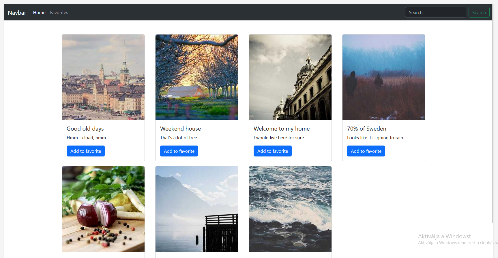
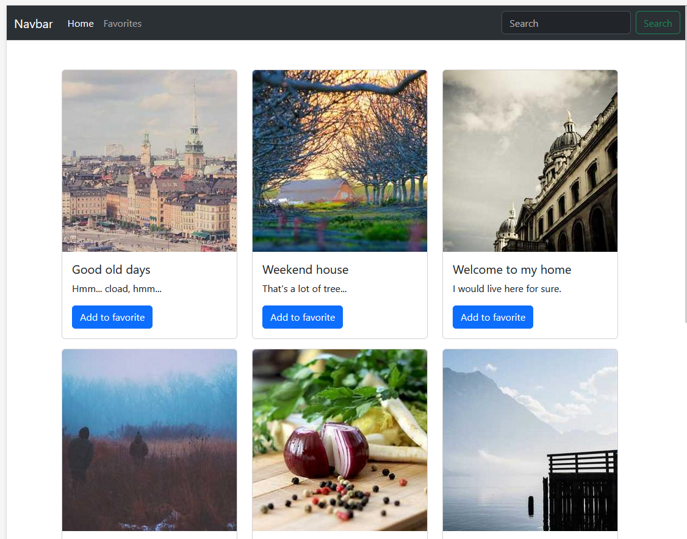
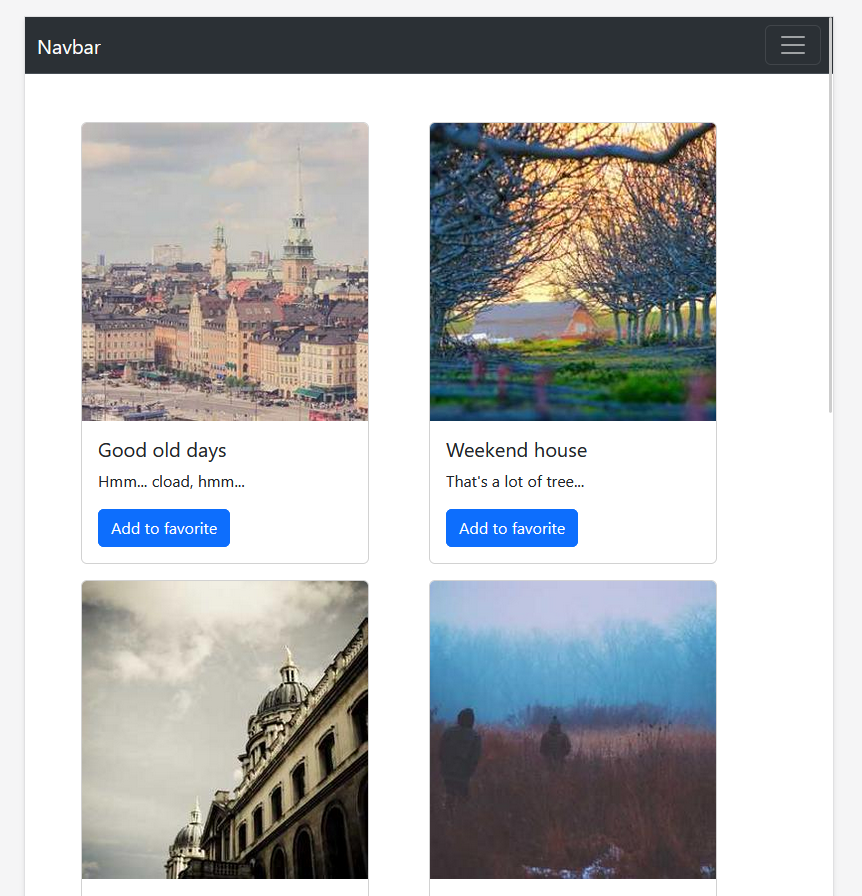

# My little gallery

You have been tasked to create the frontend of a gallery site in one day, you asked: *"Are you serious right now?"* One of your friends recommended you to use Bootstrap for this task, with it you might be able to create an acceptable solution in one day, he also recommended you use the Bootstrap grid layout for added responsivity for the images.

Your boss also said that the site has to be responsive, it must contain a navbar and a filter feature with the user being able to add his/her favorite images to his/her favorites collection, which can be displayed with the click of a button.

*Check out the hints section before you begin.*

# Tasks

**Check the documentation and watch the provided video in the Hints section**

Review what the Grid layout is and check out the different breakpoints it can support.

- Read the linked sections from the documentation and check the example code snippets.
- Watched the provided video.

**Set up your project**

For this project, you will have to create a new HTML file which you can open with your browser as well as a JavaScript file to write your own logic.

Create these files, include Bootstrap in your HTML as well as your own JS file.

- A new HTML file has been created (eg.: index.html) as well as a new JS file (eg.: script.js).
- Added the compiled Bootstrap source files to the project.

**Navbar**

Create a navbar at the top of your page, later on, you will have to implement a filter feature so it would be optimal if your navbar contained an input field for searches.

- Navbar added to the page, the navbar must be responsive.

**Display images with details**

Your next task is to display the provided images, along with some text inside of a component.
[This](https://getbootstrap.com/docs/5.3/components/card/#about) Bootstrap component can be a good option but you can choose a different solution too. Make sure that the provided image and its description appear correctly and that these components are being displayed in a way where they are positioned nicely together.

*Display these images*
```js
const images = [
    {
        id: 0,
        title: "Good old days",
        url: "https://picsum.photos/id/288/288/300",
        description: "Hmm... cload, hmm..."
    },
    {
        id: 1,
        title: "Weekend house",
        url: "https://picsum.photos/id/289/288/300",
        description: "That's a lot of tree..."
    },
    {
        id: 2,
        title: "Welcome to my home",
        url: "https://picsum.photos/id/290/288/300",
        description: "I would live here for sure."
    },
    {
        id: 3,
        title: "70% of Sweden",
        url: "https://picsum.photos/id/291/288/300",
        description: "Looks like it is going to rain."
    },
    {
        id: 4,
        title: "Shrek",
        url: "https://picsum.photos/id/292/288/300",
        description: "Ogres are like onions."
    },
    {
        id: 5,
        title: "Scandinavian lake",
        url: "https://picsum.photos/id/293/288/300",
        description: "Soo... who is up for some fishing?"
    },
    {
        id: 6,
        title: "Balaton???",
        url: "https://picsum.photos/id/295/288/300",
        description: "The water is soo clean, this surely isn't the Balaton."
    }
]
 ```

- The provided array of data is displayed inside a Bootstrap component of your choice.
- Make it responsive, at full screen, 4 components are displayed in a row and this number keeps decreasing as you keep reducing the screen width.

**Filter**

Implement a filter functionality. Update your navbar so the user can filter the images by their description or title. Make the images appear on the screen whose title or description includes the searched term.

- The user can search in the navbar, a filter should preferably happen on a button click.
- The matching images are being displayed.


**Favorite images**

Implement a feature where the user can select images as favorites, it's ok if the user's favorite images are only stored in memory for now.
In the navbar the user can click on a link or button which will display only the images marked as favorites. If the user clicks on the home link or button then every image gets' displayed again.

- The user can save images as favorites with a button press inside the image's component.
- Clicking on the favorites link or button in the navbar displays only the favorite images.
- Clicking on the home link or button in the navbar displays every image again.

# Hints
Check out the official documentation for the Bootstrap Grid layout, check out the example at the top of the page and read the [How it works](https://getbootstrap.com/docs/5.3/layout/grid/#how-it-works) section as well as the [Grid options](https://getbootstrap.com/docs/5.3/layout/grid/#grid-options) section and take a look at the example code snippets below.

Check out [this](https://youtu.be/yMn4re9rzxc) short video before you begin.

# Example
**Large screen**



**Medium screen**



**Small screen**




<!-- rework this, the user can view the grid on his own and put more pressure on the responsive part, the student create a galary with bootstrap cards, maybe he could include other bootstrap elements BG and PROJECT -->