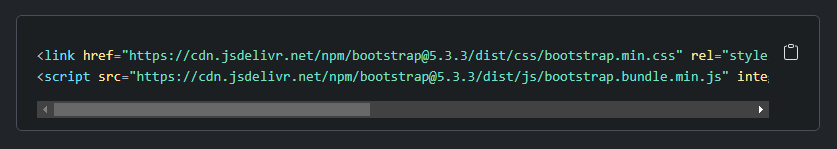
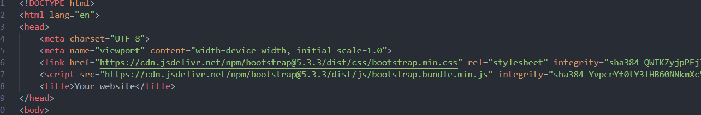
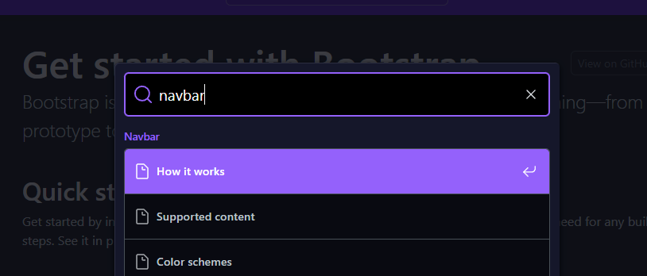
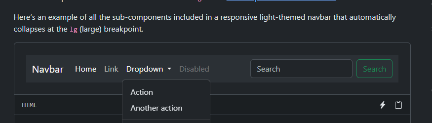
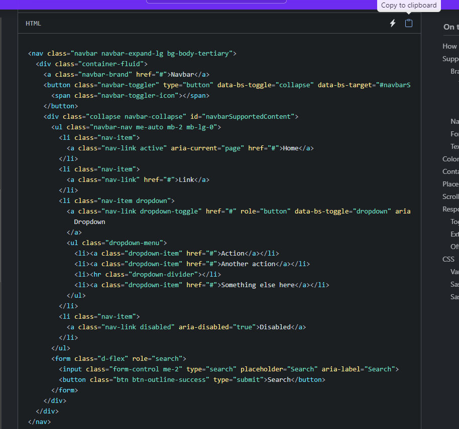
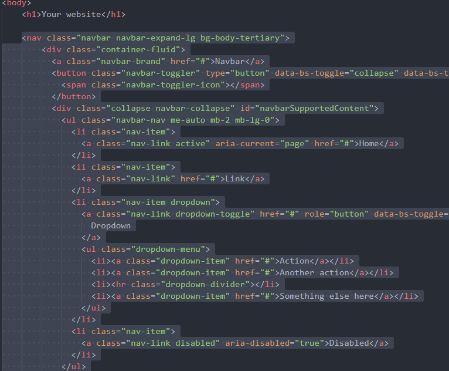
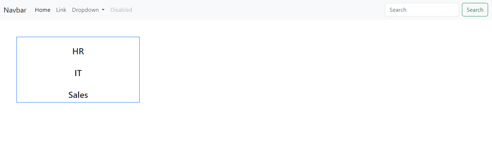
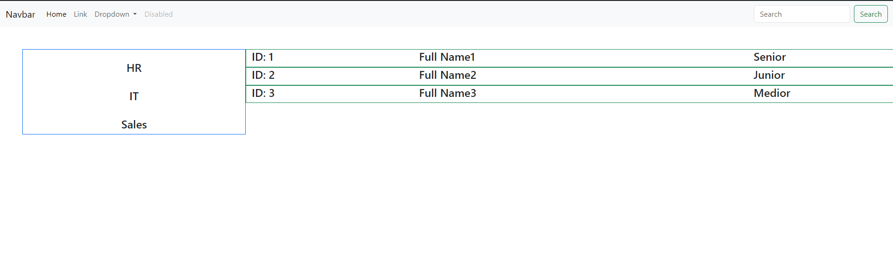

# What you will learn?

- How to install and add Bootstrap to your project
- How to use Bootstrap 
- What bootstrap grid is and how it works


# How to install and add Bootstrap to your project

There are actually **multiple** ways to add `bootstrap` to your project. 

In **most cases**, you will have to **download** the `CSS library/framework` as a separate **package** and **dependency** for your project **from** the appropriate **repository** *(for example from the npm repository for npm and node)*, but for **smaller CSS libraries** it's also ok to **request** the required **CSS** and **JS** **files** from a **third party server**.

For **now**, while you are working with `native` `HTML`, `CSS` and `JS`, I would **recommend** you to **add** `bootstrap` to your project by **importing** it from a third-party server.

The [Official Documentation](https://getbootstrap.com/docs/5.3/getting-started/download/#cdn-via-jsdelivr) explains how you can do it in a very straightforward way. 
Simply **copy** the **highlighted** two lines of code and add them to the `head` section of every `HTML` file you have.

**Like this:**

**Copy from the official website:**


**and paste it into the head of every HTML file you have:**


Great, you added bootstrap to your project, in the next section let's check out how it is supposed to work.

# How to use Bootstrap 

After installing bootstrap you are pretty much all set.

Feel free to browse the [Official Documentation](https://getbootstrap.com/docs/5.3/getting-started/) and check out the available components and style options for certain HTML elements and for more complex features. 

Typically you can find an element, you check out how it looks and below you can find an example code snippet that can copy and paste into your project.

For example, let's say that you wanted to have a navigation bar on your web page,
first, you can check if bootstrap has a navbar implementation.
Search for "Navbar":


### Yes, there is a navbar implementation, let's check it out:



### Ok, it looks nice:



### Copy the code snippet for it:



### Paste it into your HTML file:



### And there you go, you now have a navbar in your project:


As you can see when a **mediocre** to good level of design is **satisfactory** then it's so good to have these **pre-written** **solutions**, you can of course **continue** to **browse** for other **components** to add to your project, and you can modify these example snippets all you want.

# What bootstrap grid is and how it works

Nice, you managed to integrate a **Bootstrap** **component** into your project, now let's talk about another powerful concept in Bootstrap called the `Bootstrap grid`.

We talked about **responsivity** a lot during the module and we also know from experience that it's important to be able to have a specified **layout** for the different **sections** on our web page. 

How good it would be if there were a **solution** that provides a responsive layout where we can size our components relative to this layout. This is where the **Bootstrap grid** comes in. 

*(At this point as you are already familiar with the concept of the CSS flexbox, you could come up with a solution like this on your own since behind the scenes the Bootstrap Grid also uses flexboxes, but we don't want to reinvent the wheel for every project, we can use an already existing solution.)*

Before we continue further please read this short [documentation.](https://getbootstrap.com/docs/5.3/layout/grid/)

Alright, let's see an `example`. Let's say we want to **split** the **screen** into **two columns**, **one** column displays **departments** and the **other** one displays the **people** working in them (id, name, position).

First, we will have to define a `container element`, we will put all of our code **inside** of this `container`. I am using `container fluid` now so it will **fill** the **whole** **screen**. Read more [here!](https://getbootstrap.com/docs/5.3/layout/containers/#how-they-work)

```html
      <main class="container-fluid">

      </main>
 ```

 Now let's define a `row` and inside of the `row`, we can define the two `columns` we want to have, the **column** on the **left** should be **smaller** than the **column** on the **right**. The right column should fill all the remaining space.

 ```html
       <main class="container-fluid">
         <section class="row">
          <div class="col-3"></div>
          <div class="col-9"></div>
        </section>
      </main>
 ```

 In Bootstrap, a `row` can be **divided** into `12 units` of the `same size`, now the **first** column should take **3 units** of space and the **other** one should take the **remaining 9**.

 Now let's populate the left column with some placeholder data. What I am going to do is, I am going to create a **new row** inside of the column and another **column** in it which will take all the space. The name of the department should be in the middle. If you don't specify the size of a `col` then it will **evenly** **distribute** the **available** **space**.

 ```html
    <main class="container-fluid m-5" >
        <section class="row">
          <div class="col-3 border border-primary">

            <div class="row mt-4">
              <div class="col text-center">
                <h4>HR</h4>
              </div>
            </div>

            <div class="row mt-4">
              <div class="col text-center">
                <h4>IT</h4>
              </div>
            </div>

            <div class="row mt-4">
              <div class="col text-center">
                <h4>Sales</h4>
              </div>
            </div>

          </div>
          <div class="col-9"></div>
        </section>
      </main>
 ```

 *Note: For better visibility, I also used the Bootstrap margin and border tags as well, you can skip these if you want to.*

 

 As you can see, the **left column** indeed **displays** the **departments** as expected. Notice that the left column takes 1/4 of the screen size. It is because previously we added the `col-3` class tag to the left column while the other one received `col-9` and a row contains `12` units of equal size.

 Let's continue by displaying some **placeholder** employees in the left column with the appropriate data and layout.

 I **added** another row for each employee inside of the `9 unit` wide **column** and I declared **additional** **columns** of different sizes inside of the row. For me this is what it looks like: 

 ```html
        <div class="row border border-success m1">
            <div class="col-3">
                <h4>ID: 1</h4>
            </div>
            <div class="col-6">
                <h4>Full Name1</h4>
            </div>
            <div class="col-3">
                <h4>Senior</h4>
            </div>
        </div>
 ```

I decided to give the ID a **3 unit** partition which is **25%** of the available **space** inside of the row, a **6 unit** partition for the name which is **50%** of the available space and another **3 unit (25%)** for the position.

My full code looks like this (without the navbar):

```html
    <main class="container-fluid m-5" >
        <section class="row">
          <div class="col-3 border border-primary">

            <div class="row mt-4">
              <div class="col text-center">
                <h4>HR</h4>
              </div>
            </div>

            <div class="row mt-4">
              <div class="col text-center">
                <h4>IT</h4>
              </div>
            </div>

            <div class="row mt-4">
              <div class="col text-center">
                <h4>Sales</h4>
              </div>
            </div>

          </div>
          <div class="col-9">

            <div class="row border border-success m1">
              <div class="col-3">
                <h4>ID: 1</h4>
              </div>
              <div class="col-6">
                <h4>Full Name1</h4>
              </div>
              <div class="col-3">
                <h4>Senior</h4>
              </div>
            </div>

            <div class="row border border-success m1">
              <div class="col-3">
                <h4>ID: 2</h4>
              </div>
              <div class="col-6">
                <h4>Full Name2</h4>
              </div>
              <div class="col-3">
                <h4>Junior</h4>
              </div>
            </div>


            <div class="row border border-success m1">
              <div class="col-3">
                <h4>ID: 3</h4>
              </div>
              <div class="col-6">
                <h4>Full Name3</h4>
              </div>
              <div class="col-3">
                <h4>Medior</h4>
              </div>
            </div>

          </div>
        </section>
    </main>
```

and this is the result:

 

When you are using the `Bootstrap library` it's actually not a bad idea to set the **full layout** of the page with the use of the provided `Grid layout`.


# Recap

- After `importing` `Bootstrap's CSS and JS` files you can simply **copy + paste** **code snippets** from the **documentation** and **integrate** any available Bootstrap **component** you like.
- The **components** and **class tags** provided by Bootstrap are **fully compatible** with each other and provide a `responsive` **solution** out of the box.
- **Bootstrap grid** is an easy-to-use **layout** solution that a `container`, `rows` and `columns`.
- A **row's full width** is divided into **12 equal units**, you can **set** the **size** of the **columns** inside of the **row** **with** the usage of these **units**.
- It's perfectly **valid** to place a **row** **inside** of a **column** and further columns inside of it to organize your more deeply nested elements in a `sub-layout`.


# Questions
- Do you think that it's possible to create a minimalistic but responsive website without writing a single line of CSS, only using Bootstrap?
- Is there any component you would like to try out in your next project?


# Word of advice

I would highly recommend you check out the official documentation below time from time again when you are working with it in your project. It's actually a very realistic thing to actively have the documentation open and to check it out every now and then when we are working with a framework/library.


- [The Official Documentation for Bootstrap Grid](https://getbootstrap.com/docs/5.3/layout/grid/)
