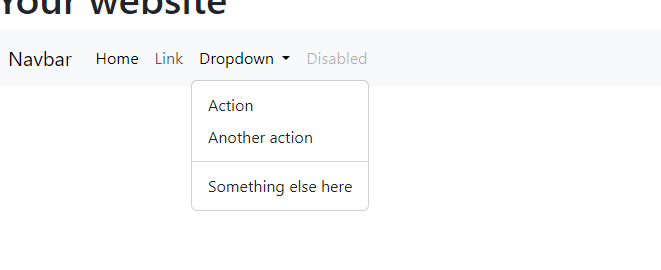

# What you will learn?

- How to install and add Bootstrap to your project
- How to use Bootstrap 
- What bootstrap grid is and how it works

# How to install and add Bootstrap to your project

There are actually **multiple** ways to add `bootstrap` to your project. 

In **most cases**, you will have to **download** the `CSS library/framework` as a separate **package** and **dependency** for your project **from** the appropriate **repository** *(for example from the npm repository for npm and node)*, but for **smaller CSS libraries** it's also ok to **request** the required **CSS** and **JS** **files** from a **third party server**.

For **now**, while you are working with `native` `HTML`, `CSS` and `JS`, I would **recommend** you to **add** `bootstrap` to your project by **importing** it from a third-party server.

The [Official Documentation](https://getbootstrap.com/docs/5.3/getting-started/download/#cdn-via-jsdelivr) explains how you can do it in a very straightforward way. 
Simply **copy** the **highlighted** two lines of code and add them to the `head` section of every `HTML` file you have.

**Like this:**

**Copy from the official website:**

**and paste it into the head of every HTML file you have:**

Great, you added bootstrap to your project, in the next section let's check out how it is supposed to work.

# How to use Bootstrap 

After installing bootstrap you are pretty much all set.

Feel free to browse the [Official Documentation](https://getbootstrap.com/docs/5.3/getting-started/) and check out the available components and style options for certain HTML elements and for more complex features. 

Typically you can find an element, you check out how it looks and below you can find an example code snippet that can copy and paste into your project.

For example, let's say that you wanted to have a navigation bar on your web page,
first, you can check if bootstrap has a navbar implementation.
Search for "Navbar":

### Yes, there is a navbar implementation, let's check it out:

### Ok, it looks nice:

### Copy the code snippet for it:

### Paste it into your HTML file:

### And there you go, you now have a navbar in your project:

As you can see when a mediocre to good level of design is satisfactory then it's so good to have these pre-written solutions, you can of course continue to browse for other components to add to your project, and you can modify these example snippets all you want.

# What bootstrap grid is and how it works

