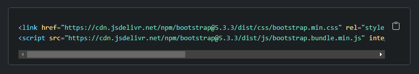
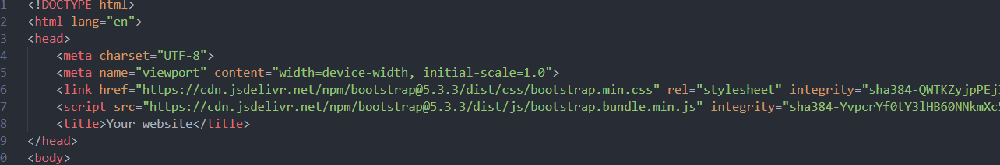
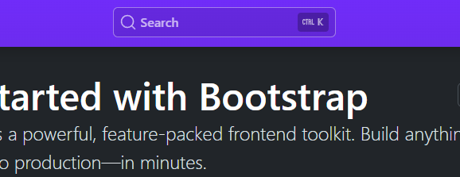
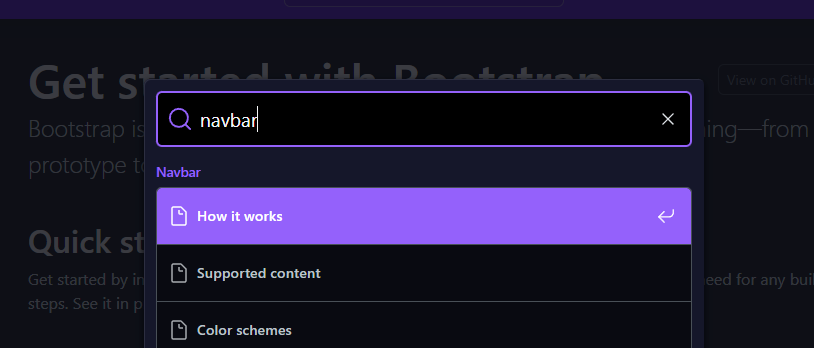
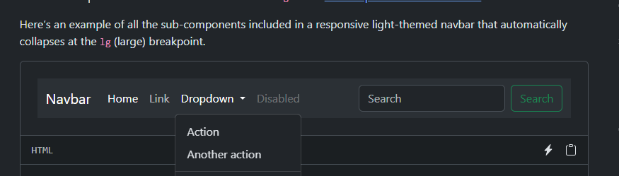
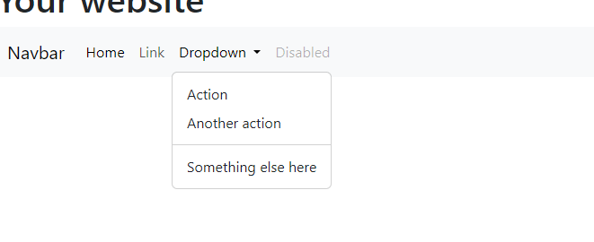

# What you will learn?

- What are CSS frameworks/libraries?
- Why should you as a developer consider using such solutions?
- What are the advantages of using a CSS framework/library?
- How to install and add Bootstrap to your project
- How to use Bootstrap 

# What are CSS frameworks/libraries?

At this time, you already become familiar with the **basics** of `CSS`, 
you can **style** most `HTML` `elements` with a variety of `CSS` `properties`, but for you to be a more efficient developer, more is needed.

During real-life development, especially if you **aren't** working on a **public website** or **web application**, and your application will only be used in the internal network of a company, then having very unique and stunning **styling** might **not** be your absolute **priority**, but at the same time, your application needs to look decently since people are going to use it potentially daily.

In situations like this, very often you may measure the possibility of using a `CSS framework` or `library`.

A `CSS library` basically contains a bunch of **pre-written CSS**. Commonly used components have multiple **responsive** styles, they look professional but are oftentimes reasonably simple. It is also common, that these pre-written styles are already responsive and there are pre-written `CSS classes` that you can use to support **multiple screen sizes** and devices, so you don't have to write everything from scratch, instead, you can use a **well-tested** solution right away.

There is an abundance of `CSS libraries` and `frameworks`, but if you can use one or two of these libraries, the third won’t be much of a challenge.
`Bootstrap` is a **widely known** and **reliable** `CSS library`, and you’ll learn how to use it too.

*Sidenote: Most of the projects contain some tasks about how to style them in the end,
but you are encouraged to go wild sometimes if you have an idea about how else could the project be made more visually appealing*.

# Why should you as a developer consider using such solutions?

It all comes down to your **priorities** regarding the **project** **considering** the **target audience**.

For example, when it comes to a `public website` and your **priority** is to give the best **impression** to the **user** about a project or a company, then chances are that your priority will be to have a very smooth, very **modern looking**, very accessible and **visually appealing design**.

Surely you would give a lot of attention to details lookswise and you would try to come up with something unique. 

Most **people judge** things greatly by their **first experiences** interacting with them, so it makes sense that you would **try** to make something **less generic** and less repetitive.

Now think about a `browser-based` `application` that is primarily used in an **office** by more technical people or in an **administration**-heavy sector.

Now your **focus** has **changed**, the goal is to put **less** effort into **appearance** and **more** on **functionality** and just displaying data in a **user-friendly** manner.

In this case, your **goal** is to be as **simple** as possible, the app has to be very straightforward with as **few distractions** as possible but still has to be styled in a way that it's not pure pain to use on a daily basis.

Here is where `CSS libraries/frameworks` come in handy.

# What are the advantages of using a CSS framework/library?

To put it simply a `CSS framework/library` is just a bunch of **pre-written** `CSS` and potentially some JS code that you can apply to your HTML elements by passing certain class names to them.

A solution like this can contain pre-written CSS to set:
- The layout inside of a container element
- Design for basic HTML elements (eg.: button, input, select etc.) including hover effects and other simple effects
- Rules for different screen sizes or sometimes you don't even have to set these rules because the default behavior is more than satisfactory

These work out of the box and they can integrated into any project with relative ease. It is oftentimes the case that you will end up not having to write any CSS code yourself at all.

# How to install and add Bootstrap to your project

There are actually **multiple** ways to add `Bootstrap` to your project. 

In **most cases**, you will have to **download** the `CSS library/framework` as a separate **package** and **dependency** for your project **from** the appropriate **repository** *(for example from the npm repository for npm and node)*, but for **smaller CSS libraries** it's also ok to **request** the required **CSS** and **JS** **files** from a **third party server**.

For **now**, while you are working with `native` `HTML`, `CSS` and `JS`, I would **recommend** you to **add** `bootstrap` to your project by **importing** it from a third-party server.

The [Official Documentation](https://getbootstrap.com/docs/5.3/getting-started/download/#cdn-via-jsdelivr) explains how you can do it in a very straightforward way. 
Simply **copy** the **highlighted** two lines of code and add them to the `head` section of every `HTML` file you have.

**Like this:**

**Copy from the official website:**

**and paste it into the head of every HTML file you have:**

Great, you added `Bootstrap` to your project, it seems as if nothing has happened yet but the fact is that now you can take advantage of all the p`re-written components` and `CSS` that Bootstrap has to offer. 

Now let's take a look at how you are supposed to work with it.

# How to use Bootstrap 

After installing bootstrap you are pretty much all set.

Feel free to browse the [Official Documentation](https://getbootstrap.com/docs/5.3/getting-started/) and check out the available components and style options for certain HTML elements and for more complex features. 

Typically you can find an element, you check out how it looks and below you can find an example code snippet that can copy and paste into your project.

For example, let's say that you wanted to have a navigation bar on your web page,
first, you can check if bootstrap has a navbar implementation.
Search for "Navbar":

### Yes, there is a navbar implementation, let's check it out:

### Ok, it looks nice:

### Copy the code snippet for it:

### Paste it into your HTML file:

### And there you go, you now have a navbar in your project:

As you can see when a **mediocre** to good level of design is **satisfactory** then it's so good to have these **pre-written** **solutions**, you can of course **continue** to **browse** for other **components** to add to your project, and you can modify these example snippets all you want.

# Recap

- CSS frameworks/libraries are usually used for projects where a more generic design is more than satisfactory and there isn't a great emphasis on detailed, good-looking visuals. 
- Most CSS frameworks/libraries come with design options for the most commonly used HTML elements, including basic animations and they can be used to set the layout of the app.
- Solutions like these can be integrated into an existing project with usually just a few imports.
- After `importing` `Bootstrap's CSS and JS` files you can simply **copy + paste** **code snippets** from the **documentation** and **integrate** any available Bootstrap **component** you like.
- The **components** and **class tags** provided by Bootstrap are **fully compatible** with each other and provide a `responsive` **solution** out of the box.

# Questions

- Can you think about existing organizations or companies where you would use a CSS library to develop browser-based applications?
- Many developers could write nicer-looking designs than what these CSS libraries have to offer, what advantages does using a solution like this have?
- Please take a look at [this link](https://getbootstrap.com/docs/5.3/components/accordion/) and search through the components section on the left, pay special attention to the provided example code snippets. Do you think that you could make a simple but user-friendly web app by only using these components?
- Do you think that it's possible to create a minimalistic but responsive website without writing a single line of CSS, only using Bootstrap?
- Is there any component you would like to try out in your next project?

# Word of advice

I would highly recommend you check out the official documentation below time from time again when you are working with it in your project. It's actually a very realistic thing to actively have the documentation open and to check it out every now and then when we are working with a framework/library.

# More on this topic

If you want to dig deeper into this topic here are some resources.
Apart from Bootstrap it's ok if you only take a look at what components the other frameworks offer, you don't have to download them.

- [Bootstrap documentation, you will use it a lot, consider bookmarking it](https://getbootstrap.com/docs/5.3/getting-started/introduction/)
- [Check out these design elements at Prime Family, they support multiple popular frontend libraries including React](https://primereact.org/calendar/)
- [Tailwind, also a popular CSS framework, check out what kind of components it has](https://tailwindcss.com/docs/installation)
